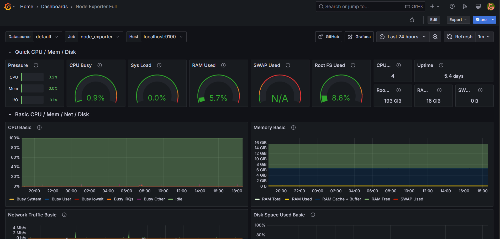

# 🐳 Dockerized Node.js App with Monitoring

This project is a **Node.js application** running in a Docker container, complete with a monitoring stack powered by **Prometheus** and **Grafana**. I built this to demonstrate how to containerize a web app and set up observability using modern tools, making it a great addition to my DevOps portfolio.
---

## 🌟 Project Overview

This is a lightweight **Express.js** app deployed via **Docker Compose**, with a monitoring setup to track performance. Prometheus scrapes metrics, and Grafana provides beautiful visualizations. It’s a practical example of containerization and observability in action.

### Tech Stack
- **Node.js (Express)**: Core web application framework
- **Docker & Docker Compose**: Containerization and orchestration
- **Prometheus**: Metrics collection and storage
- **Grafana**: Visualization of metrics with dashboards

---

## 📂 Project Structure

```
dockerized-node-monitoring/
├── app/
│   ├── app.js              # Main Express.js application
│   └── package.json        # Node.js dependencies and scripts
├── monitoring/
│   └── prometheus.yml      # Prometheus configuration
├── Dockerfile              # Docker setup for Node.js app
├── docker-compose.yml      # Orchestrates app and monitoring services
└── README.md               # Project documentation
```

---

## 🐳 Getting Started

Follow these steps to run the app and monitoring stack locally:

### Prerequisites
- **Docker** and **Docker Compose** installed
- Node.js (optional, for local development outside Docker)

### Run the Project
1. Clone the repository:
   ```bash
   git clone https://github.com/your-username/dockerized-node-monitoring.git
   cd dockerized-node-monitoring
   ```

2. Build and start the services:
   ```bash
   docker-compose up --build
   ```

3. Access the services:
   - **Node.js App**: [http://localhost:3000](http://localhost:3000)
   - **Prometheus**: [http://localhost:9090](http://localhost:9090)
   - **Grafana**: [http://localhost:3001](http://localhost:3001) (default login: `admin` / `admin`)

4. Stop the services:
   ```bash
   docker-compose down
   ```

---

## 📈 Monitoring Setup

The monitoring stack is pre-configured to track the app’s performance:
- **Prometheus**: Scrapes metrics from the Node.js app (configured in `monitoring/prometheus.yml`).
- **Grafana**: Visualizes metrics with customizable dashboards. After logging in, add Prometheus as a data source and import or create dashboards to view metrics.



---

## 📌 Additional Notes

- The `Dockerfile` builds a lightweight Node.js image for the app.
- The `docker-compose.yml` file orchestrates the app, Prometheus, and Grafana services.
- Grafana’s default credentials (`admin` / `admin`) should be changed in production.
- Prometheus is configured to scrape metrics from the app, but you’ll need to add metric endpoints for full functionality.

---

## 🔮 Future Improvements

Here’s what I’m planning to enhance:
- Integrate **prom-client** to expose metrics from the Node.js app
- Add a pre-configured **Grafana dashboard** for common metrics (e.g., HTTP requests, latency)
- Implement **health checks** in Docker Compose for better reliability
- Add **alerting** with Prometheus Alertmanager
- Secure Grafana with custom credentials and HTTPS

---

## 🤝 Contributing

I’d love to hear your ideas or improvements! To contribute:
1. Fork the repo
2. Create a branch for your changes
3. Submit a pull request with a clear description

Let’s make this project even better together!

---

## 📄 License

This project is licensed under the [MIT License](https://opensource.org/licenses/MIT). Feel free to use it for your own projects or learning.

---

*Built with 🐳 and 📈 to explore containerization and monitoring in DevOps.* 😄
